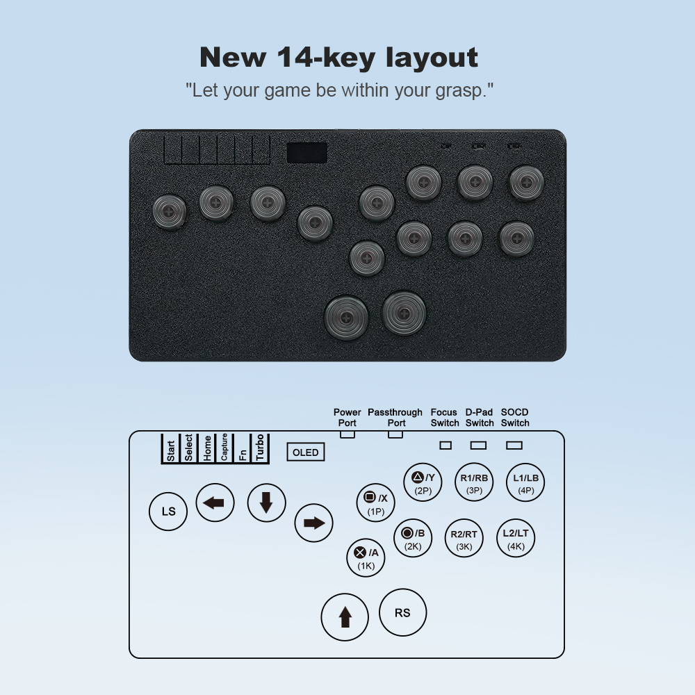
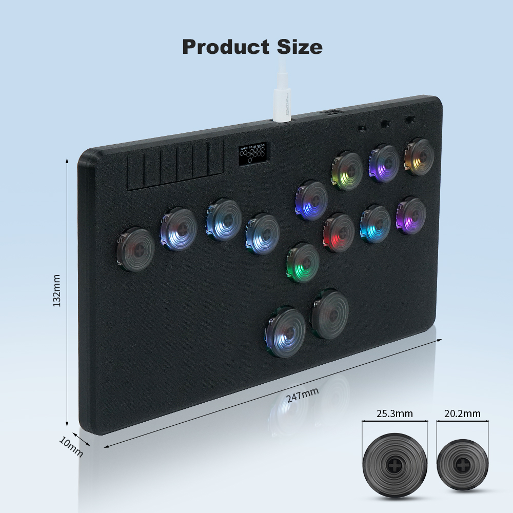

# Flatbox-LED-Ultra

[Flatbox-LED the ultimate fighting keyboard]()

flatbox-led-ultra is a Low profile hitbox-layout fightstick which improved and extended on the [Flatbox-rev4](https://github.com/jfedor2/flatbox.git). Using  [GP2040-CE](https://github.com/OpenStickCommunity/GP2040-CE) firmware. Featuring OLED display, full-color LED lightings, and a brand new 3D printed shell.Pair it with the transparent punk keycap for an even better user experience.

| Hardware/Features |  Flatbox-LED | Flatbox-LED-PRO | Flatbox-LED-Ultra| 
| ----| ---- | ---- |
|flatbox layout | 12keys | 12keys | 14keys |
|OLED display | yes | yes| yes |
|Focus on mode | no | yes| yes|
|D-PAD/left stick/right stick/ mode| noly choose by the Hotkeys | yes , can choose by a slider| yes , can choose by a slider|
|SOCD mode| noly choose by the Hotkeys | yes, can can choose by a slider|  yes, can can choose by a slider|
|USB Passthrough| no  | yes |

